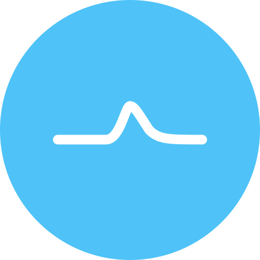
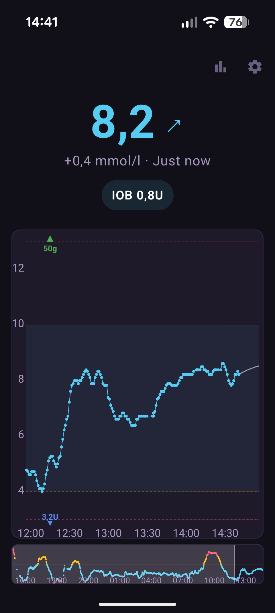
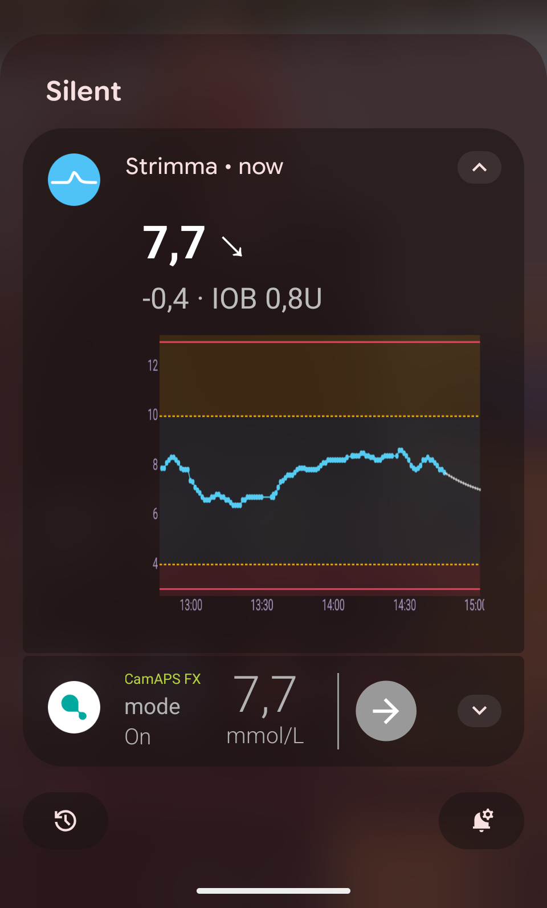
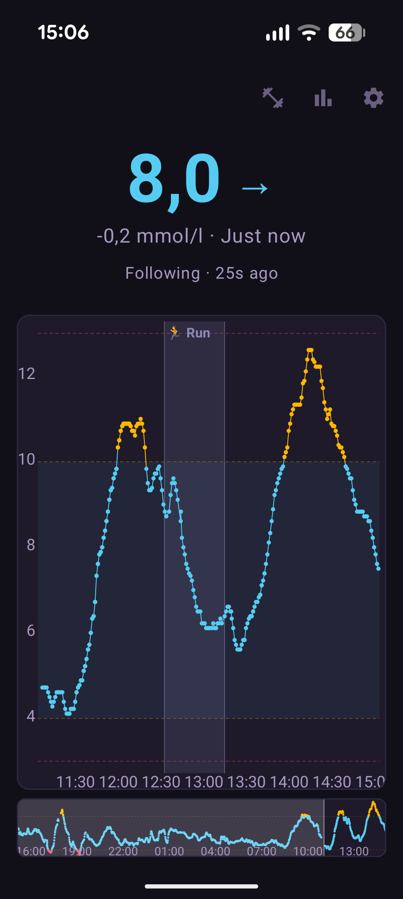
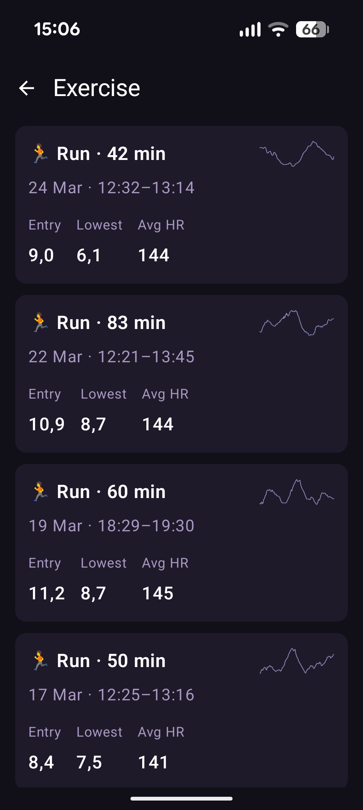
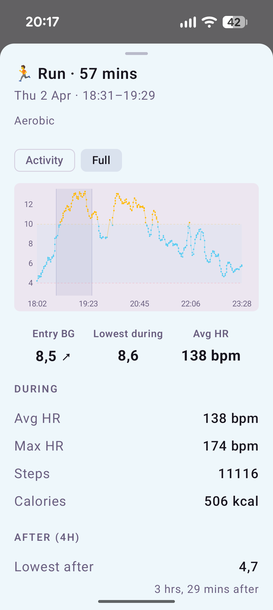

<p align="center">
  
</p>

<h1 align="center">Strimma</h1>

<p align="center">
  Open-source Android CGM companion app.<br />
  Reads glucose from 60+ CGM apps, displays with interactive graph and alerts, pushes to Nightscout.
</p>

<p align="center">
  <a href="https://github.com/psjostrom/strimma/releases"><strong>Download</strong></a> · <a href="https://psjostrom.github.io/Strimma/"><strong>Docs</strong></a> · <a href="https://psjostrom.github.io/Strimma/getting-started/setup/"><strong>Setup Guide</strong></a>
</p>

## What It Does

Strimma sits alongside your CGM app and gives you a better glucose display, alerts, and Nightscout integration — without replacing your CGM app or interfering with closed-loop systems.

**Data sources** — pick what fits your setup:

- **Companion Mode** — reads glucose from your CGM app's notification. Works with Dexcom, Libre, CamAPS FX, Juggluco, xDrip+, Medtronic, Eversense, and 50+ more.
- **xDrip Broadcast** — receives data from apps that broadcast in xDrip format (AAPS, Juggluco, xDrip+).
- **Nightscout Follower** — follows a remote Nightscout server. For caregivers and remote monitoring.
- **LibreLinkUp** — reads glucose from Abbott's LibreLinkUp cloud. For Libre 3 users.

**Display & alerts:**

- Interactive graph with pinch-zoom, pan, scrub-to-inspect, and 24h minimap
- Prediction warnings ("Low in X min" / "High in X min")
- Persistent notification with mini graph
- Home screen widget (Glance)
- Configurable alerts: urgent low, low, high, urgent high, stale — each with its own notification channel

**Exercise-BG analysis** via Health Connect (Garmin, Samsung Health, Strava, Google Fit, etc.):

- Lavender exercise bands overlaid on the glucose graph — tap to inspect
- Per-session analysis: entry BG with trend, min BG, max drop rate per 10 min, post-exercise lowest/highest with timing
- Delayed post-exercise hypo detection (4-hour window after exercise ends)
- Heart rate, steps, calories from watch data
- Exercise history screen with BG sparklines per session
- Writes glucose to Health Connect so other health apps can access CGM data

**Integration:**

- Nightscout push via `/api/v1/entries` with retry and offline resilience
- Treatment sync from Nightscout (30-day retention) — bolus/carb markers on graph, IOB computation with configurable insulin curves, per-meal analysis
- xDrip-compatible BG broadcast for watches and other apps (AAPS, GDH)
- Local web server for Garmin watchfaces and other LAN clients

**Stats:**

- Time in range, GMI, average glucose, CV%, coverage, CSV export
- Ambulatory Glucose Profile (AGP) with percentile bands
- Per-meal postprandial analysis: TIR, peak excursion, time-to-peak, recovery, IOB at meal, sparkline graphs
- Aggregate postprandial profile — AGP-style percentile chart showing average meal response
- Configurable meal time slots (Breakfast/Lunch/Dinner)

## Screenshots

<p align="center">
  
  
  
</p>

<p align="center">
  
  
  
</p>

## Install

Download the latest APK from [GitHub Releases](https://github.com/psjostrom/strimma/releases) and install it. Requires Android 13+.

A setup wizard walks you through permissions and data source configuration on first launch. See the [Setup Guide](https://psjostrom.github.io/Strimma/getting-started/setup/) for details.

## Development

```bash
git clone https://github.com/psjostrom/strimma.git
cd strimma
./gradlew assembleDebug          # build
./gradlew installDebug           # build + install on connected device
./gradlew testDebugUnitTest      # run tests
```

Requires Java 21.

### Architecture

Single-module app. Kotlin, Jetpack Compose, Material 3.

| Package | Purpose |
|---------|---------|
| `data/` | Room entities, DAO, SettingsRepository, DirectionComputer, GlucoseUnit |
| `data/meal/` | Per-meal postprandial analysis, aggregate AGP, time slot classification |
| `data/health/` | Health Connect — exercise sessions, BG analysis, HC sync |
| `di/` | Hilt dependency injection modules |
| `graph/` | Shared graph constants, colors, Y-range, prediction |
| `network/` | NightscoutClient, NightscoutPusher, NightscoutFollower, LibreLinkUpFollower (Ktor) |
| `notification/` | NotificationHelper, GraphRenderer, AlertManager |
| `receiver/` | GlucoseNotificationListener, XdripBroadcastReceiver, GlucoseParser |
| `service/` | StrimmaService (foreground), BootReceiver |
| `ui/` | Compose screens (Main, Settings, Stats, Setup, Debug), ViewModels, theme |
| `webserver/` | Local HTTP server for LAN clients (Garmin watchfaces, etc.) |
| `widget/` | Glance widget |

**DI:** Hilt. **Async:** Coroutines/Flow. **Storage:** Room + DataStore + EncryptedSharedPreferences. **Tests:** JVM via Robolectric.

### Contributing

All changes go through pull requests. PRs require signed commits, linear history (squash merge), and all review conversations resolved.

## Acknowledgments

Strimma exists because of [xDrip+](https://github.com/NightscoutFoundation/xDrip). Its feature set, UI patterns, and data pipeline are directly inspired by xDrip+'s decade of pioneering work. The CGM package list in Companion Mode is based on xDrip+'s `UiBasedCollector.coOptedPackages`.

## License

[GNU General Public License v3.0](LICENSE)
