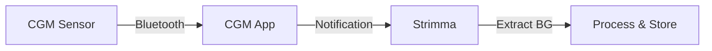

# Companion Mode

Companion mode is the default and most common way to use Strimma. It reads glucose values from your CGM app's notifications.

---

## How It Works

1. Your CGM app receives a glucose reading from your sensor via Bluetooth
2. The CGM app posts a notification showing the glucose value
3. Strimma reads the notification and extracts the glucose value
4. The value is processed, stored, displayed, and optionally pushed to Nightscout

Strimma automatically detects whether the notification shows glucose in mmol/L or mg/dL and converts as needed. Values are validated to be in the physiological range (1.0–50.0 mmol/L / 18–900 mg/dL) — anything outside this is ignored.

---

## Supported Apps

Strimma recognizes notifications from 60+ CGM app variants across all major manufacturers:

- **Dexcom** — G6, G7, ONE, D1+, Stelo (all regional variants)
- **Abbott** — Libre 2, Libre 3, LibreLink
- **CamAPS FX** — all variants (mmol/L and mg/dL)
- **Medtronic** — Guardian Connect, MiniMed Mobile, Simplera
- **Eversense** — all versions including Gen12 and 365
- **Third-party** — xDrip+, Juggluco, Diabox
- **Others** — Aidex, Sinocare, Suswel, GlucoTech, OttAI

See [Supported CGM Apps](supported-apps.md) for the complete list.

---

## Direction Computation

Strimma computes the glucose direction (trend arrow) **locally** rather than trusting what your CGM app reports. This ensures consistent, clinically-validated trend information regardless of which CGM app you use.

The direction uses EASD/ISPAD standard thresholds, computed from a 3-point average of recent readings. See [Direction Arrows](../reference/direction.md) for details.

---

## Deduplication

Strimma automatically ignores duplicate readings. If your CGM app updates its notification multiple times for the same reading, only the first is processed.

---

## Does It Interfere with My CGM App?

**No.** Strimma only reads notifications — it doesn't modify them, intercept them, or affect your CGM app in any way. Your CGM app continues to work normally, including closed-loop systems like CamAPS FX or AndroidAPS.

---

## Troubleshooting

!!! question "Strimma doesn't see my CGM app's notifications"
    1. Check that notification access is granted: **Android Settings > Special app access > Notification access > Strimma**
    2. Check that your CGM app is posting notifications (some apps let you disable them)
    3. Check the debug log (**Settings > Debug Log**) for messages about received or rejected notifications
    4. If your CGM app isn't in the [Supported Apps](supported-apps.md) list, please [open an issue](https://github.com/psjostrom/Strimma/issues)

!!! question "Values look wrong"
    Check the debug log for the raw text Strimma extracted from the notification. If you find a parsing issue, [open an issue](https://github.com/psjostrom/Strimma/issues) with the debug log snippet.
