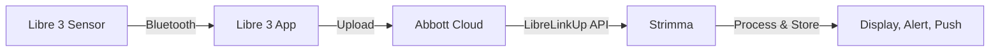

# LibreLinkUp Mode

LibreLinkUp mode polls Abbott's LibreLinkUp sharing API for glucose readings from Libre 3 sensors. No third-party apps beyond the Libre 3 app needed — just your LibreLinkUp credentials.

---

## Who Is This For?

- **Libre 3 users** — Libre 3 notifications don't contain glucose values, so LibreLinkUp is the way to get Libre 3 data into Strimma
- **Users without xDrip+ or Juggluco** — direct connection to Abbott's cloud
- **Anyone sharing via LibreLinkUp** who wants Strimma's alerts, graph, and Nightscout push

---

## Prerequisites

Before setting up LibreLinkUp in Strimma, you need:

1. **A Libre 3 sensor** actively connected to the Libre 3 app, showing readings
2. **LibreLinkUp sharing accepted** at least once (see first-time setup below)

### First-Time Setup

If you've never used LibreLinkUp before, you need to enable sharing once:

1. Open the **Libre 3** app
2. Go to **Menu > Connected Apps > LibreLinkUp > Manage**
3. Tap **Add Connection** and enter the email address you want to use
4. Install the **LibreLinkUp** app from Google Play
5. Sign in to LibreLinkUp and **accept the sharing invitation**
6. Verify that readings appear in the LibreLinkUp app
7. You can uninstall the LibreLinkUp app afterwards — Strimma talks directly to Abbott's API

If you've already set up LibreLinkUp sharing previously, skip straight to configuring Strimma below.

!!! tip "Same or different account?"
    You can use the same email and password as your Libre 3 app, or a separate account — both work. The important thing is that the LibreLinkUp connection has been accepted at least once.

!!! warning "Connected Apps unavailable?"
    If "Connected Apps" gives an error saying "this feature is not currently available", you may have previously signed in on another device or third-party app. Log out of your account in the Libre 3 app and log back in — this forces all other sessions to disconnect. Then try Connected Apps again.

---

## Setup

1. Go to **Settings > Data Source**
2. Select **LibreLinkUp**
3. Enter your **Email** and **Password**
4. Strimma connects immediately and starts polling every 60 seconds

Optionally, configure Nightscout push below the credentials to forward readings to your Nightscout server.

---

## How It Works

1. Your Libre 3 sensor sends readings to the Libre 3 app via Bluetooth
2. The Libre 3 app uploads readings to Abbott's cloud
3. Strimma polls the LibreLinkUp API every 60 seconds
4. New readings are validated (18–900 mg/dL), direction is computed locally, and readings are stored
5. Readings are displayed, alerts fire, and optionally pushed to Nightscout and Health Connect

---

## Regional Support

LibreLinkUp uses regional API servers. When you log in, Strimma automatically detects your region and redirects to the correct server. Supported regions:

- **EU** (eu, eu2) — Europe
- **US** — United States
- **DE** — Germany
- **FR** — France
- **AP** — Asia Pacific
- **AU** — Australia
- **CA** — Canada
- **JP** — Japan

No manual configuration needed — region detection is transparent.

---

## Connection Status

When connected and receiving data, no status text is shown — the reading's own timestamp indicates freshness. Status only appears when something is wrong:

- **Connecting...** — initial login in progress
- **Connection lost Xm** — last poll failed, showing how long ago

---

## Token Refresh

LibreLinkUp auth tokens expire after approximately 60 minutes. Strimma automatically re-authenticates every 50 minutes to avoid interruptions. This is seamless — you won't notice it.

---

## Nightscout Push

Unlike Nightscout Follower mode, LibreLinkUp mode **supports pushing to Nightscout**. This lets you:

- Share your Libre 3 data with caregivers via Nightscout
- Use Nightscout reports and analysis tools
- Feed data to downstream apps (Springa, watchfaces, etc.)

Configure the Nightscout push URL and API secret in **Settings > Data Source** below your LibreLinkUp credentials.

---

## Timestamp Handling

Strimma uses the `FactoryTimestamp` field from the LibreLinkUp API, which is always in UTC with a consistent `M/d/yyyy` format across all regions. This avoids the date ambiguity problem that the regional `Timestamp` field has (where `3/5/2026` could mean March 5 or May 3 depending on region). Both 12-hour (AM/PM) and 24-hour time variants are supported.

---

## Troubleshooting

!!! question "No data appears"
    - Verify the LibreLinkUp app itself shows readings — if it doesn't, Strimma can't get them either
    - Verify sharing is enabled in the Libre 3 app (Menu > Connected Apps > LibreLinkUp > Manage)
    - Verify you accepted the sharing invitation in the LibreLinkUp app
    - Check the debug log for "LLU: bad credentials" or "LLU: no connections found"

!!! question "Status shows 'connection lost'"
    - Check your internet connection
    - If you recently changed your LibreLinkUp password, update it in Strimma settings
    - Check the debug log for "LLU: account action required" — you may need to accept updated terms in the LibreLinkUp app

!!! question "Readings are delayed"
    LibreLinkUp mode has inherent latency: sensor → Libre 3 app → Abbott cloud → Strimma poll. The 60-second poll interval means readings can be up to 60 seconds older than in Companion mode. For most users, this is negligible — Libre 3 produces a reading every minute.

!!! question "Region redirect keeps failing"
    If you see "LLU: unknown region" in the debug log, your LibreLinkUp account may be in a region not yet mapped. [Open an issue](https://github.com/psjostrom/strimma/issues) with the region code from the debug log.
