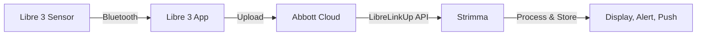

# LibreLinkUp Mode

LibreLinkUp mode polls Abbott's LibreLinkUp sharing API for glucose readings from Libre 3 sensors. No third-party apps needed — just your LibreLinkUp credentials.

---

## Who Is This For?

- **Libre 3 users** who don't want to rely on notification parsing
- **Users without xDrip+ or Juggluco** — direct connection to Abbott's cloud
- **Anyone sharing via LibreLinkUp** who wants Strimma's alerts, graph, and Nightscout push

---

## Prerequisites

Before setting up LibreLinkUp in Strimma, you need:

1. **A Libre 3 sensor** actively connected to the Libre 3 app
2. **LibreLinkUp sharing enabled** in the Libre 3 app
3. **A LibreLinkUp account** (created when you accept the sharing invitation)

### Enable Sharing in Libre 3

1. Open the **Libre 3** app
2. Go to **Menu > Connected Apps > LibreLinkUp**
3. Tap **Add Connection** and enter the email address you want to use
4. Check your email and **accept the invitation** to create or link a LibreLinkUp account

!!! warning "Use your follower credentials"
    The credentials you enter in Strimma are your **LibreLinkUp (follower) account** credentials — the email and password you used when accepting the sharing invitation. These may differ from your Libre 3 app login.

---

## Setup

1. Go to **Settings > Data Source**
2. Select **LibreLinkUp**
3. Enter your **Email** and **Password**
4. Strimma connects immediately and starts polling every 60 seconds

Optionally, configure Nightscout push below the credentials to forward readings to your Nightscout server.

---

## How It Works

1. Your Libre 3 sensor sends readings to the Libre 3 app via Bluetooth
2. The Libre 3 app uploads readings to Abbott's cloud
3. Strimma polls the LibreLinkUp API every 60 seconds
4. New readings are validated (18–900 mg/dL), direction is computed locally, and readings are stored
5. Readings are displayed, alerts fire, and optionally pushed to Nightscout and Health Connect

---

## Regional Support

LibreLinkUp uses regional API servers. When you log in, Strimma automatically detects your region and redirects to the correct server. Supported regions:

- **EU** (eu, eu2) — Europe
- **US** — United States
- **DE** — Germany
- **FR** — France
- **AP** — Asia Pacific
- **AU** — Australia
- **CA** — Canada
- **JP** — Japan

No manual configuration needed — region detection is transparent.

---

## Connection Status

The main screen shows your LibreLinkUp connection status:

- **Following · Xs ago** — connected, showing time since last successful poll
- **Following · connecting...** — initial login in progress
- **Following · connection lost Xm** — last poll failed, showing how long ago

---

## Token Refresh

LibreLinkUp auth tokens expire after approximately 60 minutes. Strimma automatically re-authenticates every 50 minutes to avoid interruptions. This is seamless — you won't notice it.

---

## Nightscout Push

Unlike Nightscout Follower mode, LibreLinkUp mode **supports pushing to Nightscout**. This lets you:

- Share your Libre 3 data with caregivers via Nightscout
- Use Nightscout reports and analysis tools
- Feed data to downstream apps (Springa, watchfaces, etc.)

Configure the Nightscout push URL and API secret in **Settings > Data Source** below your LibreLinkUp credentials.

---

## Timestamp Handling

LibreLinkUp returns timestamps in regional date formats (US: `M/d/yyyy`, EU: `d/M/yyyy`, 12h/24h variants). Strimma handles all known formats automatically. All timestamps are interpreted as UTC.

---

## Troubleshooting

!!! question "No data appears"
    - Verify sharing is enabled in the Libre 3 app (Menu > Connected Apps > LibreLinkUp)
    - Verify you accepted the sharing invitation email
    - Verify the email and password are your LibreLinkUp credentials (not your Libre 3 app login)
    - Check the debug log for "LLU: bad credentials" or "LLU: no connections found"

!!! question "Status shows 'connection lost'"
    - Check your internet connection
    - If you recently changed your LibreLinkUp password, update it in Strimma settings
    - Check the debug log for "LLU: account action required" — you may need to accept updated terms in the LibreLinkUp app

!!! question "Readings are delayed"
    LibreLinkUp mode has inherent latency: sensor → Libre 3 app → Abbott cloud → Strimma poll. The 60-second poll interval means readings can be up to 60 seconds older than in Companion mode. For most users, this is negligible — Libre 3 produces a reading every minute.

!!! question "Region redirect keeps failing"
    If you see "LLU: unknown region" in the debug log, your LibreLinkUp account may be in a region not yet mapped. [Open an issue](https://github.com/psjostrom/Strimma/issues) with the region code from the debug log.
