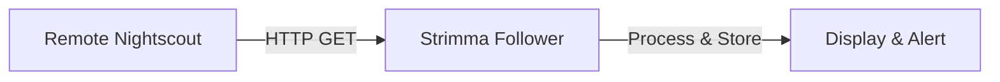

# Nightscout Follower Mode

Follower mode lets you monitor someone else's glucose remotely by polling a Nightscout server.

---

## Who Is This For?

- **Parents** watching their child's glucose
- **Partners** who want to see their loved one's BG
- **Caregivers** monitoring a patient
- **Anyone** who wants to view glucose data from a remote Nightscout server

---

## Setup

1. Go to **Settings > Data Source**
2. Select **Nightscout Follower**
3. In the **Nightscout** section, enter the **Nightscout URL** — the server you want to follow (e.g., `https://kids-nightscout.fly.dev`)
4. Enter the **API Secret** for that server
5. Adjust the **Poll Interval** if needed (default: 60 seconds)

Strimma will start polling immediately and display the first reading within one poll cycle. The Nightscout URL and API secret are shared with manual Nightscout pulls and treatment sync.

---

## How It Works

1. Strimma sends `GET /api/v1/entries.json?find[date][$gt]=<timestamp>&count=2016` to the Nightscout server
2. New entries are validated (type "sgv", value 18–900 mg/dL)
3. Direction and delta are computed locally from the received data
4. Readings are stored in the local database and displayed

---

## Poll Interval

Configure how often Strimma checks for new readings:

| Interval | Description |
|----------|-------------|
| 30 seconds | Fastest updates, higher battery/data usage |
| 60 seconds (default) | Good balance of freshness and efficiency |
| 120 seconds | Conservative, lower battery usage |
| 300 seconds | Minimal polling (5 minutes, matches Dexcom cycle) |

!!! info "CGM reading frequency"
    Most CGMs produce a new reading every 1 minute (Libre 3) or 5 minutes (Dexcom). There's limited benefit in polling more frequently than the CGM reports. However, the delay between the CGM reading and it appearing on Nightscout varies by setup.

---

## Automatic Backfill

When Strimma connects to a Nightscout server for the first time (or if the database has no recent data), it automatically backfills up to **7 days** of history. This populates the graph and statistics immediately.

Backfill happens in pages of 2016 entries, fetching until all available data in the 7-day window is retrieved.

---

## Connection Status

Connection status is shown inline in **Settings > Data Source**, below the poll interval slider (when Nightscout Follower is selected):

- **Connected · Last reading: X ago** — connected, shown in cyan
- **Connection lost** / **Backfill failed** — last poll failed, shown in red

Staleness is also signaled on the main screen by the BG timestamp ("5 min ago") and the stale data alert.

---

## Deduplication

Follower mode prevents duplicate readings using:

- **3-second threshold** — readings within 3 seconds of an existing reading are treated as duplicates
- **15-minute lookback** — each new reading is checked against the last 15 minutes of stored data

---

## Shared Nightscout Server Settings

In follower mode, Strimma does **not** push readings back to Nightscout — the data already came from Nightscout. The Nightscout URL and API secret remain visible in **Settings > Data Source** because Strimma uses one shared Nightscout server configuration for follower mode, manual pulls, and treatment sync.

---

## Treatment Sync in Follower Mode

Treatment sync works in follower mode. If enabled, Strimma fetches treatments from the configured Nightscout server.

---

## Troubleshooting

!!! question "No data appears"
    - Verify the Nightscout URL is correct (include `https://`, no trailing slash)
    - Verify the API secret is correct
    - Check that the Nightscout server is online and has recent data
    - Check the debug log for HTTP errors

!!! question "Data is delayed"
    Follower mode has inherent latency: CGM reading → CGM app → Nightscout upload → Strimma poll. The poll interval adds to this. Lower the poll interval in settings if you need faster updates.

!!! question "Connection keeps dropping"
    Check your internet connection. Strimma will automatically resume polling when connectivity returns. Transient network errors are normal and don't require action.
