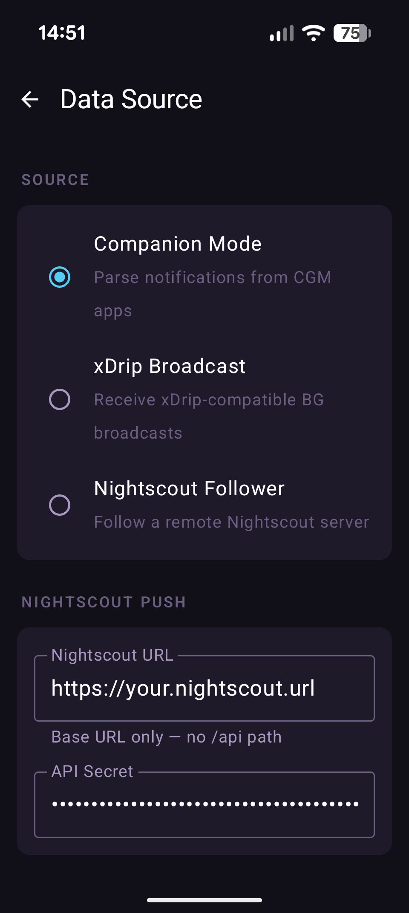

# Data Sources

Strimma supports four ways to receive glucose data. You choose one in **Settings > Data Source**.

{ width="300" }

---

## Companion Mode (Default)

Strimma reads glucose values from your CGM app's notifications. This is the primary mode for most users.

**How it works:** Your CGM app (Dexcom, LibreLink, CamAPS FX, etc.) posts a notification with your glucose value. Strimma reads the notification, extracts the glucose value, and processes it.

**Pros:**

- Works with 50+ CGM app variants out of the box
- No extra configuration beyond notification access
- No interference with your CGM app or closed-loop system
- No separate Bluetooth connection needed

**See:** [Companion Mode](companion.md) for details.

---

## xDrip Broadcast Mode

Strimma receives glucose via xDrip-compatible broadcast intents.

**How it works:** Apps like xDrip+, Juggluco, or AndroidAPS can broadcast glucose values as Android intents. Strimma listens for the `com.eveningoutpost.dexdrip.BgEstimate` broadcast.

**Pros:**

- Direct data path (no notification parsing)
- Works with any app that broadcasts xDrip-compatible intents
- Useful if your CGM app's notifications aren't being parsed correctly

**See:** [xDrip Broadcast](xdrip-broadcast.md) for details.

---

## Nightscout Follower Mode

Strimma polls a remote Nightscout server for glucose readings.

**How it works:** Strimma periodically requests new readings from a Nightscout server's API. This is for people who want to see someone else's glucose (caregiver, parent, partner).

**Pros:**

- Remote monitoring — no CGM app needed on this phone
- Configurable poll interval (30s to 5 min)
- Automatic backfill on first connection

**See:** [Nightscout Follower](nightscout-follower.md) for details.

---

## LibreLinkUp Mode

Strimma polls Abbott's LibreLinkUp sharing API for glucose readings from Libre 3 sensors.

**How it works:** You enter your LibreLinkUp credentials in Strimma. Strimma polls the LibreLinkUp API every 60 seconds, retrieves glucose readings, and processes them — no third-party apps beyond the Libre 3 app required.

**Pros:**

- Direct connection to Abbott's cloud — no notification parsing or intermediary apps
- Automatic regional API detection (EU, US, AU, etc.)
- Supports Nightscout push (unlike Nightscout Follower)
- Simple setup — just email and password

**See:** [LibreLinkUp](librelinkup.md) for details.

---

## Comparison

| Feature | Companion | xDrip Broadcast | Nightscout Follower | LibreLinkUp |
|---------|-----------|-----------------|---------------------|-------------|
| Needs CGM app on phone | Yes | Depends on source app | No | Yes (Libre 3) |
| Needs Nightscout server | No (optional for push) | No (optional for push) | Yes | No (optional for push) |
| Latency | Near-instant | Near-instant | Poll interval (30s–5m) | ~60s |
| Push to Nightscout | Yes | Yes | No (already on NS) | Yes |
| Supported CGM apps | 50+ variants | Any xDrip-compatible | Any Nightscout-connected | Libre 3 only |
| Best for | Most users | xDrip+/AAPS/Juggluco users | Caregivers, remote monitoring | Libre 3 users without third-party apps |

---

## Switching Data Sources

When you switch data sources in settings:

1. The previous source is stopped (notification listener detached, broadcast receiver unregistered, or follower polling stopped)
2. The new source is started
3. Existing readings in the database are preserved
4. The switch takes effect immediately

!!! warning "Only one source at a time"
    Strimma only receives data from one source at a time. If you switch to Follower mode, Companion mode stops — even if your CGM app is still posting notifications.
