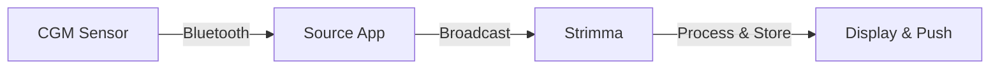

# xDrip Broadcast Mode

xDrip Broadcast mode receives glucose data via the standard xDrip-compatible broadcast intent.

---

## How It Works

Many diabetes apps can broadcast glucose readings using the xDrip+ format — a standard in the DIY diabetes community. Strimma listens for these broadcasts and processes them like any other glucose reading.

---

## Setup

1. Go to **Settings > Data Source**
2. Select **xDrip Broadcast**
3. In your source app, enable xDrip-compatible broadcasting

### Enabling Broadcasts in Common Apps

=== "xDrip+"
    **Settings > Inter-app settings > Broadcast locally**

=== "Juggluco"
    **Settings > Connections > xDrip+ broadcast**

=== "AndroidAPS"
    **Config Builder > General > NSClient > Settings > Broadcast to xDrip+**

=== "GlucoDataHandler"
    **Settings > xDrip+ broadcast**

---

## Self-Loop Prevention

If you have **both** xDrip Broadcast mode (input) and BG Broadcast output enabled, Strimma automatically prevents feedback loops — it ignores its own broadcasts.

---

## Validation

Received values must be in the range 18–900 mg/dL. Invalid values are silently ignored and logged to the debug log.

---

## When to Use This Mode

- You're already running xDrip+, Juggluco, or AAPS and they're broadcasting glucose
- Your CGM app's notifications aren't being parsed correctly in Companion mode
- You want a direct data path without notification parsing

---

## Comparison with Companion Mode

| Aspect | Companion | xDrip Broadcast |
|--------|-----------|-----------------|
| Data source | CGM app's notification | xDrip-format broadcast |
| Unit handling | Auto-detect mmol/L or mg/dL | Always mg/dL |
| Works with | 50+ CGM app variants | Apps that broadcast in xDrip format |
| Direction | Computed locally | Computed locally |
