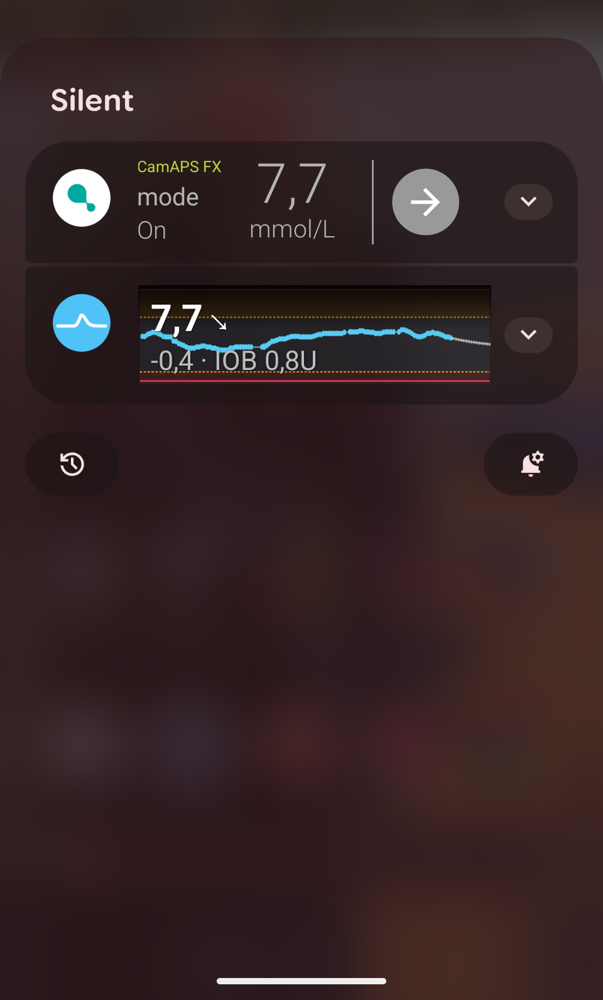

# Notifications

Strimma maintains a persistent foreground notification so you can see your glucose without opening the app.

---

## Foreground Notification

The foreground notification is always visible while Strimma is running. It serves two purposes:

1. **Quick glucose reference** — see your BG, trend, and history at a glance
2. **Android requirement** — Android requires foreground services to show a notification

### Collapsed View

{ width="300" }

The notification bar shows:

- **Small icon** — your current BG value rendered as a tiny bitmap (visible in the status bar)
- **Title** — glucose value and direction arrow (e.g., "108 →")
- **Subtitle** — delta, prediction warning, and IOB (e.g., "+5 · Low 10m · IOB 2.3U")

### Expanded View

{ width="300" }

Pull down the notification to see:

- All the information from the collapsed view
- **Glucose graph** — a 1-hour history rendered as a bitmap, showing:
    - Color-coded readings (cyan/amber/red)
    - In-range zone band
    - Threshold lines
    - Prediction curve (dashed line extending into the future)
    - Time axis labels

---

## Notification Graph Settings

Configure the notification graph in **Settings > Notifications**:

| Setting | Options | Default |
|---------|---------|---------|
| Graph time range | 30 min, 1 hour, 2 hours, 3 hours | 1 hour |
| Prediction window | Off, 15 min, 30 min | 15 min |

---

## Subtitle Components

The notification subtitle packs multiple pieces of information, separated by ` · `:

1. **Delta** — how much glucose changed (e.g., "+0.3" or "-1.2"). Uses compact format without units.
2. **Prediction warning** (optional) — only shown when you're in range and a crossing is predicted: "Low 10m" or "High 5m".
3. **IOB** (optional) — only shown when treatment sync is enabled and IOB > 0: "IOB 2.3U".
4. **Workout indicator** (optional) — only shown when workout mode is on: "Workout" for the first minute, then "Workout 0:42" with elapsed time. See [Workout Mode](workout-mode.md).

Example: `+0.3 · Low 10m · IOB 2.3U · Workout 0:42`

If there's no prediction and no IOB, the subtitle just shows the delta: `+0.3`

---

## Action Button

The notification includes an optional single tap-target action button. Choose what it does in **Settings → Notifications → Action Button**:

- **None** — no action button is shown.
- **Workout toggle** (default) — labeled **Start workout** when off and **End workout** when on. Tapping toggles workout mode without opening the app. Works from the lock screen and stays available even if the app is force-stopped. See [Workout Mode](workout-mode.md).
- **Snooze alerts** — pick a category (**All**, **High**, or **Low**) and a duration (**15m / 30m / 1h / 2h / 3h**). The button label reflects the choice (e.g., "Snooze all 1h"). Tapping the button applies the pause via the same mechanism as the in-app pause sheet.

When workout mode is on, the title gains a `· Workout` suffix.

---

## Silent by Design

The foreground notification is **silent** — no sound, no vibration, no badge. It's informational, not alerting. You'll see it in the notification shade and status bar, but it won't interrupt you.

Glucose alerts (low, high, urgent) are separate notifications with their own sounds and vibration. See [Alerts](alerts.md).

---

## Troubleshooting

!!! question "The notification disappeared"
    Android may kill the foreground service if battery optimization is enabled. Go to **Settings > Apps > Strimma > Battery > Unrestricted** to prevent this.

!!! question "The graph looks wrong"
    The notification graph renders as a bitmap at fixed resolution. On some devices with unusual display densities, it may look slightly different. This doesn't affect the data accuracy.

!!! question "I want to hide the notification"
    The foreground notification is required by Android for background services. You can minimize it by long-pressing the notification, tapping the settings icon, and selecting **Silent**. You cannot fully hide it without stopping Strimma.
