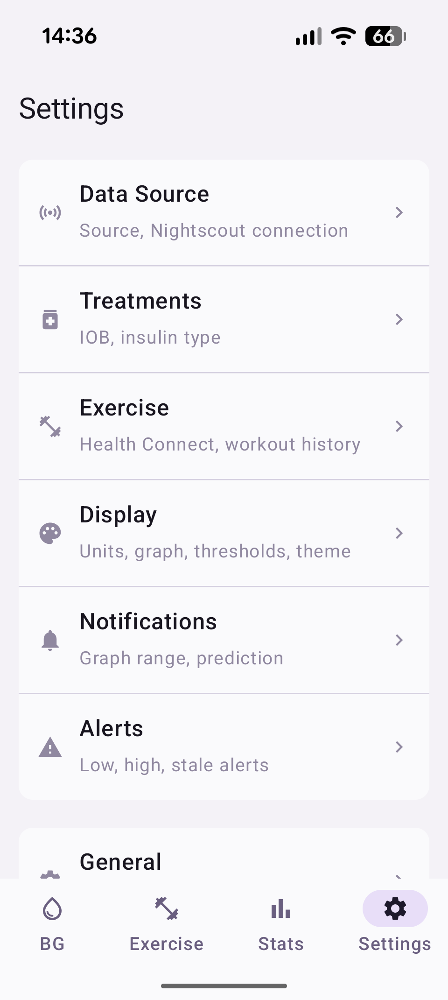

# All Settings

Complete reference for every Strimma setting.

{ width="300" }

---

## Settings Menu

The settings screen has three groups:

- **Configuration:** Data Source, Treatments, Exercise, Display, Notifications, Alerts
- **Analysis:** Statistics
- **Tools:** General, Sharing, Debug Log

---

## Data Source

Choose how Strimma receives glucose data and configure Nightscout.

| Setting | Description | Default |
|---------|-------------|---------|
| **Source** | How glucose data arrives — Companion, xDrip Broadcast, or Nightscout Follower | Companion |
| **Nightscout URL** | Base URL for pushing readings (e.g., `https://my-ns.fly.dev`) | Empty |
| **API Secret** | Nightscout API secret (stored encrypted) | Empty |
| **Follower URL** | Nightscout URL to follow (only in Follower mode) | Empty |
| **Follower Secret** | API secret for the followed server | Empty |
| **Poll Interval** | How often to check for new readings in Follower mode (30–300 seconds) | 60s |

### Nightscout Pull (Readings)

| Action | Description |
|--------|-------------|
| **Pull 7 days** | Backfill 7 days of readings from Nightscout |
| **Pull 14 days** | Backfill 14 days |
| **Pull 30 days** | Backfill 30 days |

!!! info "Auto-pull"
    When Strimma's database is empty (first install), it automatically pulls 100 days of history from Nightscout if a URL and secret are configured.

See [Data Sources](../data-sources/overview.md) for details on each mode.

---

## Treatments

Configure treatment sync and insulin parameters for IOB calculation.

| Setting | Description | Default |
|---------|-------------|---------|
| **Treatment sync** | Fetch bolus, carb, and basal data from Nightscout | Off |
| **Insulin type** | Insulin curve for IOB calculation | Fiasp |
| **Custom DIA** | Duration of Insulin Action in hours (only for Custom insulin) | 5.0h |

### Nightscout Pull (Treatments)

When treatment sync is enabled:

| Action | Description |
|--------|-------------|
| **Pull 7 days** | Backfill 7 days of treatments from Nightscout |
| **Pull 14 days** | Backfill 14 days |
| **Pull 30 days** | Backfill 30 days |

### Meal Time Slots

Configure when Breakfast, Lunch, and Dinner windows start and end. Meals outside these windows are classified as Snack.

| Setting | Default |
|---------|---------|
| **Breakfast** | 06:00–10:00 |
| **Lunch** | 11:30–14:30 |
| **Dinner** | 17:00–21:00 |

See [Treatments & IOB](treatments.md) for details.

---

## Display

Configure units, graph window, thresholds, and theme.

| Setting | Description | Default |
|---------|-------------|---------|
| **Unit** | Display unit — mmol/L or mg/dL | mmol/L |
| **Graph window** | Main graph time range (1–8 hours) | 4 hours |
| **BG Low** | Low threshold for graph coloring and TIR | 4.0 mmol/L (72 mg/dL) |
| **BG High** | High threshold for graph coloring and TIR | 10.0 mmol/L (180 mg/dL) |
| **Theme** | App appearance — Light, Dark, or System | System |
| **Language** | App language — System, English, Svenska, Deutsch, Español, Français | System |

---

## Notifications

Configure the notification graph and prediction window.

| Setting | Description | Default |
|---------|-------------|---------|
| **Graph time range** | Time shown in notification graph (30m, 1h, 2h, 3h) | 1 hour |
| **Prediction window** | How far ahead to predict (Off, 15 min, 30 min) | 15 min |

---

## Alerts

Configure glucose alerts. Each alert has an enable toggle and a threshold value.

| Setting | Description | Default |
|---------|-------------|---------|
| **Urgent Low** | Alert for dangerously low glucose | Enabled, 3.0 mmol/L (54 mg/dL) |
| **Low** | Alert for low glucose | Enabled, 4.0 mmol/L (72 mg/dL) |
| **High** | Alert for high glucose | Enabled, 10.0 mmol/L (180 mg/dL) |
| **Urgent High** | Alert for dangerously high glucose | Enabled, 13.0 mmol/L (234 mg/dL) |
| **Low Soon** | Alert when predicted to go low | Enabled |
| **High Soon** | Alert when predicted to go high | Enabled |
| **Stale Data** | Alert when no reading for 10+ minutes | Enabled |

Each alert also has a **Sound** button that opens the Android notification channel settings for customization.

See [Alerts](alerts.md) for full details.

---

## Exercise

Configure Health Connect integration, workout calendar, and pre-activity guidance.

### Health Connect

| Setting | Description | Default |
|---------|-------------|---------|
| **Health Connect sync** | Read exercise sessions from Health Connect | Off |
| **Write glucose** | Write CGM readings to Health Connect | Off |
| **Max heart rate** | Used for intensity detection on completed sessions | 190 BPM |

### Workout Calendar

| Setting | Description | Default |
|---------|-------------|---------|
| **Calendar** | Which Android calendar to monitor for workouts | None |
| **Lookahead** | How far ahead to scan for upcoming workouts | 3 hours |
| **Guidance trigger** | When the pre-activity card appears on main screen | 120 min before |

### Category Target Ranges

Each exercise category (Running, Cycling, Strength, etc.) has a configurable low and high BG threshold. Defaults come from the category's metabolic profile (Aerobic, Resistance, or High-Intensity).

See [Exercise](exercise.md) for details.

---

## Statistics

Opens the [Statistics](statistics.md) screen with Metrics, AGP, and Meals tabs.

---

## General

Startup behavior, battery, updates, and version info.

| Setting | Description | Default |
|---------|-------------|---------|
| **Start on boot** | Automatically start Strimma when the phone restarts | On |
| **Battery optimization** | Shows whether Strimma is exempt from battery optimization | — |
| **Version** | Current app version | — |
| **Check for updates** | Manually check GitHub for a new stable release | — |
| **Check for beta** | Check for pre-release versions (release candidates, betas) | — |

---

## Sharing

Integrations and backup.

### Integration

| Setting | Description | Default |
|---------|-------------|---------|
| **BG Broadcast** | Send xDrip-compatible broadcast intent | Off |
| **Local Web Server** | Serve BG on port 17580 for watches and apps | Off |
| **Web Server API Secret** | Secret for authenticating web server requests | Empty |

### Tidepool

| Setting | Description | Default |
|---------|-------------|---------|
| **Upload to Tidepool** | Sync CGM data to your Tidepool account | Off |
| **Login with Tidepool** | Opens Tidepool's login page in your browser (OIDC with PKCE) | — |
| **Force Upload Now** | Manually trigger an upload of recent readings | — |

When enabled and logged in, Strimma uploads glucose readings to Tidepool in the background. This runs independently of Nightscout push — both can be active simultaneously.

!!! info "Tidepool consent"
    On first login, Strimma shows a consent dialog explaining that uploaded data is subject to Tidepool's Privacy Policy and Terms of Use. You can disconnect at any time.

### Backup

| Action | Description |
|--------|-------------|
| **Export Settings** | Save all settings to a JSON file |
| **Import Settings** | Restore settings from a previously exported file |

!!! warning "Export contains secrets"
    The exported settings file includes your Nightscout URL and API secret in plain text. Handle the file securely.

---

## Debug Log

Opens the [Debug Screen](../troubleshooting.md#debug-log) showing real-time and file-based logs. Useful for troubleshooting issues with data reception.
