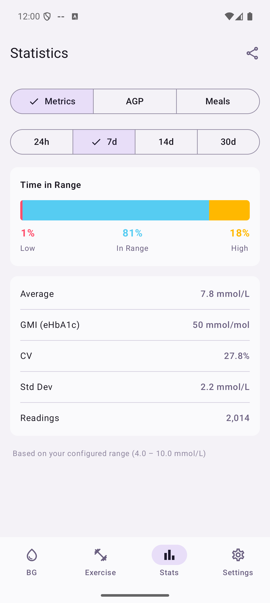
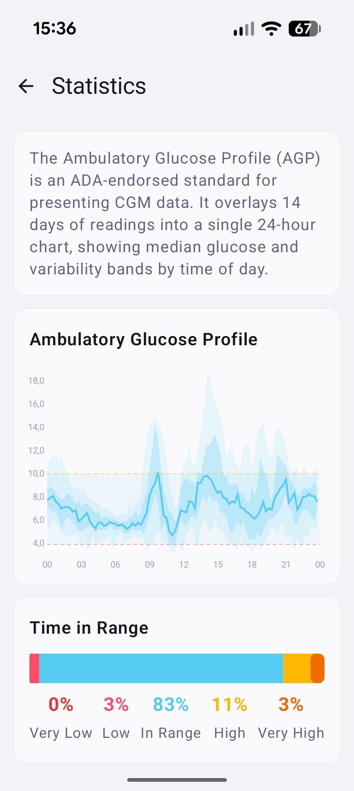
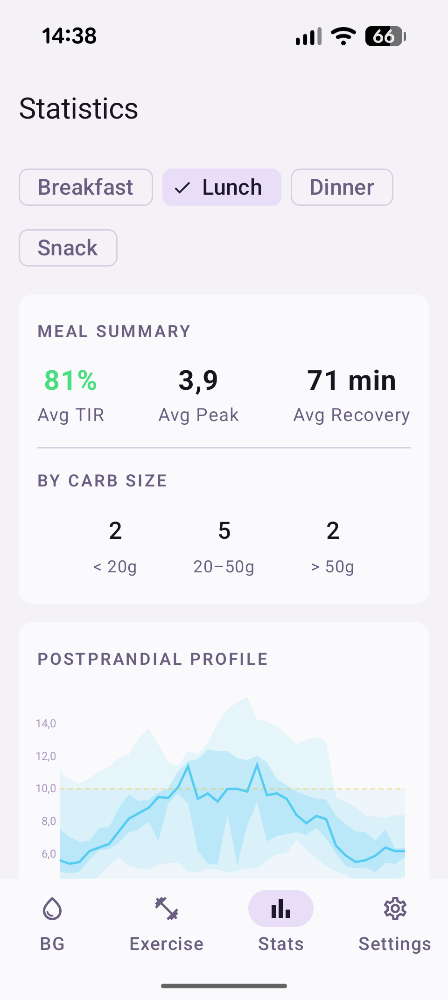

# Statistics

Strimma computes standard diabetes metrics from your glucose data.

{ width="300" }

---

## Viewing Statistics

Open statistics from the **Stats** tab in the bottom navigation.

---

## Monthly Story

A card at the top of the Statistics screen links to your **Monthly Story** — a curated summary of the previous month's glucose data. See [Monthly Story](story.md) for details.

---

## Time Periods

Select the time period at the top:

- **24 hours** — last day
- **7 days** — last week
- **14 days** — last two weeks
- **30 days** — last month

---

## Metrics

### Time in Range (TIR)

A horizontal bar chart showing the percentage of readings in each zone:

| Zone | Color | Meaning |
|------|-------|---------|
| Below range | Red | % of readings below your low threshold |
| In range | Cyan | % of readings between your low and high thresholds |
| Above range | Amber | % of readings above your high threshold |

!!! info "TIR targets"
    The international consensus target (ATTD) for most people with Type 1 diabetes is >70% time in range (3.9–10.0 mmol/L / 70–180 mg/dL), <4% time below range, and <25% time above range. Note: Strimma calculates TIR using your configured thresholds (default 4.0–10.0 mmol/L), which may differ slightly from the ATTD reference range.

### Average Glucose

Your mean glucose over the selected period, shown in your configured unit (mmol/L or mg/dL).

### GMI (Glucose Management Indicator)

An estimated HbA1c percentage derived from your average glucose:

```
GMI = 3.31 + (0.02392 × average mg/dL)
```

This is the ATTD consensus formula. GMI gives you a continuous estimate of what your lab HbA1c might be, based on CGM data alone.

!!! note
    GMI is an estimate, not a lab result. Your actual HbA1c may differ due to individual red blood cell lifespan and other factors.

### CV (Coefficient of Variation)

A measure of glucose variability:

```
CV = (standard deviation / average) × 100%
```

| CV | Interpretation |
|----|----------------|
| < 36% | Stable (target for most people) |
| 36–50% | Moderate variability |
| > 50% | High variability |

Lower CV means more stable glucose with fewer spikes and dips.

### Standard Deviation

The spread of your glucose values around the average, in your configured unit. Lower is better — it means less glucose variability.

### Reading Count

The total number of glucose readings in the selected period. This helps you assess data completeness.

---

## Export to CSV

Tap the **share icon** in the top bar to export your glucose data as a CSV file. The export includes:

| Column | Description |
|--------|-------------|
| `ts` | Unix timestamp (milliseconds) |
| `datetime` | Human-readable date and time |
| `sgv` | Glucose value in mg/dL |
| `direction` | Trend arrow |
| `delta_mgdl` | Change since previous reading in mg/dL |

The CSV covers the currently selected time period. You can share it via email, messaging, or save it to files.

---

## AGP Tab

The **AGP** tab shows an Ambulatory Glucose Profile — the ADA-endorsed standard for presenting CGM data. It overlays 14 days of readings into a single 24-hour chart, showing median glucose and variability bands (5th–95th, 25th–75th percentiles) by time of day.

{ width="300" }

Below the chart, a 5-tier Time in Range bar shows Very Low, Low, In Range, High, and Very High percentages.

---

## Meals Tab

The **Meals** tab analyzes your postprandial (after-meal) glucose response using carb treatments from Nightscout. Requires treatment sync to be enabled.

{ width="300" }

### Aggregate View

- **Meal Summary** — average TIR, peak excursion, and recovery time across all meals in the period
- **By Carb Size** — meal count breakdown by Small (<20g), Medium (20–50g), Large (>50g)
- **Postprandial Profile** — AGP-style chart showing percentile bands (5th–95th, 25th–75th) of glucose response aligned to meal time. X-axis is minutes after meal, Y-axis is glucose.

### Filters

Filter by time slot: **Breakfast**, **Lunch**, **Dinner**, **Snack**. Tap a chip to filter, tap again to show all. The postprandial profile updates to show only the selected slot.

Time slot boundaries are configurable in **Settings > Treatments > Meal time slots**.

### Per-Meal Cards

Each meal shows:

- **Collapsed** — carb amount, time slot, carb size, timestamp, TIR pill (green ≥80%, amber 50–79%, red <50%)
- **Expanded** (tap to reveal) — sparkline graph, peak excursion, time to peak, recovery time, IOB at meal

### Data Requirements

- Treatment sync must be enabled
- Treatments are retained for 100 days
- Each meal needs ≥3 pre-meal readings (15-min window) and ≥5 postprandial readings to be analyzed
- The postprandial window is 3 hours by default, extending to 4 hours if glucose hasn't recovered

---

## Range Info

The bottom of the statistics screen shows your configured range (e.g., "Range: 4.0–10.0 mmol/L") so you know what thresholds the TIR calculation uses.
