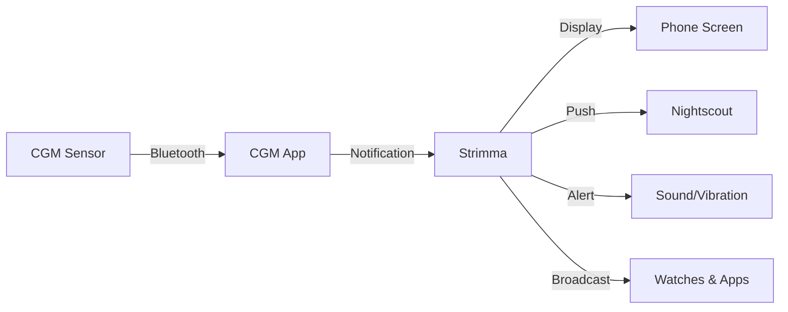

# Strimma

**Open-source Android CGM companion app for people with diabetes.**

Strimma displays your glucose with a real-time graph, alerts you when you're going low or high, and pushes your data to Nightscout. It receives glucose from your existing CGM app, from xDrip-compatible broadcasts, or by following a remote Nightscout server.

Strimma stands on the shoulders of the incredible [xDrip+](https://github.com/NightscoutFoundation/xDrip) project and the broader DIY diabetes community that proved open-source CGM tools save lives. It uses the same broadcast format, the same Nightscout protocol, and shares the same philosophy: **your data, your choice.**

---

{ width="100%" }

{ width="100%" }

{ width="100%" }

{ width="100%" }

{ width="100%" }

{ width="100%" }

## What Strimma Does

- **Receives glucose four ways** — reads notifications from 60+ CGM apps (Dexcom, Libre, CamAPS FX, etc.), receives xDrip-compatible broadcasts (from xDrip+, Juggluco, AAPS), follows a remote Nightscout server, or reads from Abbott's LibreLinkUp cloud. See [Data Sources](data-sources/overview.md).
- **Shows your BG at a glance** — large, color-coded number with direction arrow, delta, and trend graph in your notification bar.
- **Configurable alerts** — low, high, urgent low, urgent high, and stale-data alerts, each with its own notification channel. Urgent alerts bypass Do Not Disturb by default; any alert can be configured to bypass DND via Android's notification settings.
- **Predicts where you're heading** — shows "Low in X min" or "High in X min" warnings before you cross your thresholds.
- **Pushes to Nightscout** — automatic, immediate upload to any Nightscout-compatible server. Offline-resilient — readings queue and retry.
- **Tracks treatments and IOB** — fetches bolus and carb data from Nightscout, computes insulin on board with your insulin type's curve.
- **Follows a remote Nightscout** — for caregivers, partners, or parents who need to see someone else's glucose remotely.
- **Works with watches and other apps** — broadcasts xDrip-compatible intents, runs a local web server, integrates with Garmin watchfaces.
- **Exercise-BG analysis** — reads exercise sessions from Health Connect (Garmin, Samsung Health, etc.), overlays exercise bands on the glucose graph, and shows before/during/after BG breakdown with post-exercise hypo detection.

---

## How It Works

Strimma supports four data sources. Most users use **Companion mode**, which reads glucose from your CGM app's notification:

You can also receive glucose via **xDrip Broadcast** (from xDrip+, Juggluco, AAPS, or GlucoDataHandler), **Nightscout Follower** mode (for remote monitoring), or **LibreLinkUp** (Abbott's cloud for Libre 3 users). See [Data Sources](data-sources/overview.md) for all options.

---

## Who Is Strimma For?

- **People with Type 1 or Type 2 diabetes** who want an open-source glucose display with configurable alerts and Nightscout integration.
- **Parents and caregivers** who want to follow a loved one's glucose remotely via Nightscout follower mode.
- **DIY diabetes tech users** who want an open-source, hackable CGM display that respects the Nightscout protocol.
- **Closed-loop users** (CamAPS FX, AndroidAPS) who need a parallel display without interfering with their loop.

---

## Quick Start

1. **[Install Strimma](getting-started/install.md)** — download from GitHub Releases
2. **[Set up permissions](getting-started/setup.md)** — grant notification access and battery optimization exemption
3. **[See your first reading](getting-started/first-reading.md)** — open your CGM app and watch the data flow

---

## Requirements

- Android 13 or newer (API 33+)
- A CGM app that shows glucose in notifications (see [Supported Apps](data-sources/supported-apps.md))
- For Nightscout push: a Nightscout server URL and API secret

---

## Open Source

Strimma is free, open-source software licensed under [GPLv3](https://github.com/psjostrom/Strimma/blob/main/LICENSE). No ads, no tracking, no data collection. Your glucose data stays on your device and your Nightscout server.

[View on GitHub :fontawesome-brands-github:](https://github.com/psjostrom/Strimma){ .md-button }

---

!!! warning "Not a medical device"
    Strimma is an open-source display tool, not a medical device. It is not FDA or CE approved. Do not use Strimma as the sole basis for medical decisions. Always follow the guidance of your healthcare team and your official CGM app.
