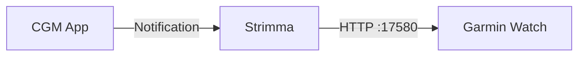
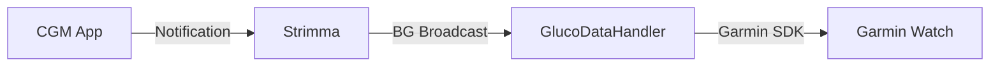

# Garmin Watches

Strimma can send glucose data to Garmin watches in two ways: via xDrip-compatible broadcasts (through GlucoDataHandler) or via the built-in local web server.

---

## Option 1: Local Web Server (Direct)

The simplest path — Strimma serves glucose data over HTTP, and the Garmin watchface reads it directly from the phone.

### Setup

1. In Strimma: **Settings > Sharing > Local Web Server** — toggle on
2. On your Garmin watch: install a watchface that reads from `http://127.0.0.1:17580/sgv.json` (e.g., [SugarWave](https://github.com/psjostrom/SugarWave))
3. Done — the watchface polls for glucose data over the phone's local connection

This works because the Garmin watch communicates with the phone app over Bluetooth, which can relay HTTP requests to localhost.

### Compatible Watchfaces

- **[SugarWave](https://github.com/psjostrom/SugarWave)** — retrowave-styled watchface with glucose graph, trend, delta, and configurable thresholds. Works with Strimma's local web server, xDrip's local server, or Nightscout.
- Any watchface that reads from xDrip's web service endpoint (`/sgv.json` on port 17580)

---

## Option 2: xDrip Broadcast via GlucoDataHandler

The traditional DIY community path — Strimma broadcasts glucose, GlucoDataHandler relays it to the watch.

### Setup

1. In Strimma: **Settings > Sharing > BG Broadcast** — toggle on
2. Install [GlucoDataHandler](https://github.com/pachi81/GlucoDataHandler) on your phone
3. In GDH: enable xDrip+ broadcast as a data source, configure your Garmin watch as a target
4. Install a compatible Garmin watchface or datafield (e.g., SugarField, AAPS Widget)

### Compatible Apps

- **SugarField** — workout datafield showing live BG value, trend arrow, delta, and staleness
- **SugarGraph** — workout datafield showing a BG history graph with configurable duration
- **AAPS Widget** — CGM watchface that works with GDH
- Any Garmin app that receives data from GlucoDataHandler

---

## Which Option to Choose?

| | Local Web Server | GDH Broadcast |
|--|-----------------|---------------|
| **Simplicity** | Simpler — no extra app | Requires GlucoDataHandler |
| **Latency** | Watch polls on interval (e.g., 5 min) | Near-instant via Garmin SDK |
| **Compatibility** | Watchfaces that read `/sgv.json` | Watchfaces that use GDH |
| **Best for** | SugarWave, xDrip web-compatible faces | SugarField, AAPS Widget, broad compatibility |

---

## Troubleshooting

!!! question "Data not appearing on watch"
    **Web server path:** Verify the web server is on (Settings > Sharing), and that your watchface is configured to read from `127.0.0.1:17580`.

    **GDH path:** Verify BG Broadcast is on, GDH shows "xDrip+ broadcast" as connected, and the Garmin watch is connected to GDH.

!!! question "Data is delayed"
    Check that your phone isn't killing background apps. Disable battery optimization for Strimma (and GDH if using that path).
