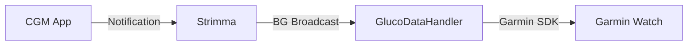

# xDrip Broadcast Output

Strimma can broadcast glucose readings as xDrip-compatible intents, allowing other apps and devices to receive your glucose data.

---

## What This Does

When enabled, Strimma sends an Android broadcast intent after each new glucose reading. Any app that listens for xDrip-compatible broadcasts will receive it.

This is the **output** direction — Strimma sends data out. For the **input** direction (receiving broadcasts from other apps), see [xDrip Broadcast Mode](../data-sources/xdrip-broadcast.md).

---

## Setup

1. Go to **Settings > Data > Integration**
2. Toggle **BG Broadcast** on

That's it. Strimma will start broadcasting immediately.

---

## Compatible Apps

Apps and devices that can receive xDrip-compatible broadcasts:

- **AndroidAPS** — closed-loop insulin delivery system
- **GlucoDataHandler (GDH)** — forwards BG to Garmin watches, Wear OS, and other targets
- **xDrip+** — can receive as a secondary data source
- **Juggluco** — can receive and display
- **Wear OS apps** — via GlucoDataHandler or similar relay

!!! tip "For Garmin watches"
    You can also use the [Local Web Server](web-server.md) instead of broadcast + GDH. Some Garmin watchfaces (like [SugarWave](https://github.com/psjostrom/SugarWave)) read glucose directly from the web server without needing GlucoDataHandler. See [Garmin Watches](garmin.md) for both options.

---

## Broadcast Format

| Field | Type | Value |
|-------|------|-------|
| Intent action | String | `com.eveningoutpost.dexdrip.BgEstimate` |
| `BgEstimate` | Double | Glucose in mg/dL |
| `Raw` | Double | Same as BgEstimate (no raw/filtered distinction) |
| `Time` | Long | Unix timestamp in milliseconds |
| `BgSlope` | Double | Rate of change (delta / 18.0182 / 5) |
| `BgSlopeName` | String | Direction name (e.g., "Flat", "SingleUp") |
| `SensorId` | String | `"Strimma"` |

---

## Self-Loop Prevention

The broadcast uses `SensorId = "Strimma"`. If you also have xDrip Broadcast **input** mode enabled, Strimma ignores its own broadcasts to prevent feedback loops.

---

## Use Case: Garmin Watches

A common setup for getting glucose on a Garmin watch:

1. Strimma receives glucose via Companion mode
2. Strimma broadcasts via xDrip-compatible intent
3. GlucoDataHandler receives the broadcast
4. GDH sends it to your Garmin watchface (e.g., SugarField datafield)

See [Garmin Watches](garmin.md) for more details.
